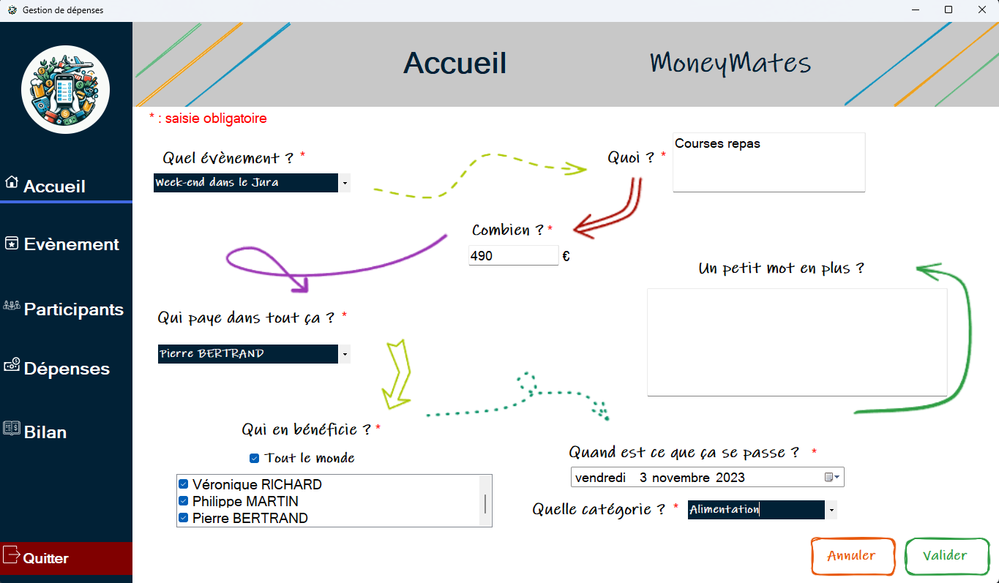
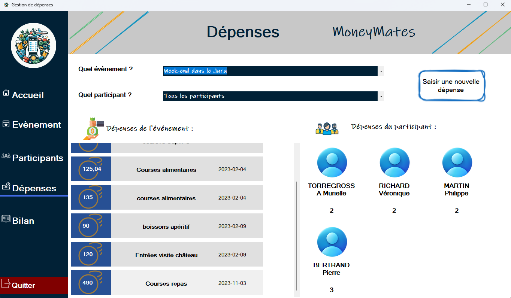
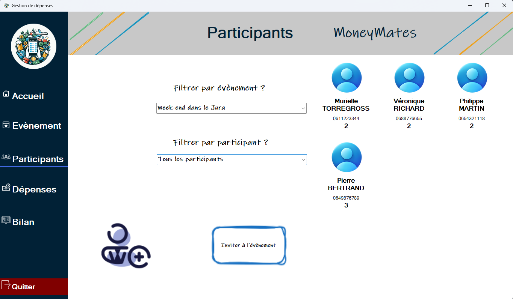

# A21-projet

## Description

**A21-projet** est une application développée dans le cadre d’un projet académique pour le BUT Informatique. Ce projet a pour objectif de faciliter la gestion des dépenses liées à des événements, en proposant des fonctionnalités pour créer, organiser et suivre ces événements.

Ce projet a été réalisé en groupe dans le cadre de ma formation à l’IUT Robert Schuman.

  
  


## Fonctionnalités

- Création et gestion d’événements.
- Suivi des dépenses associées à chaque événement.
- Interface utilisateur intuitive pour une prise en main rapide.
- Persistance des données via une base de données SQLite.
- Mise en œuvre des bonnes pratiques de développement logiciel.
- Intégration et déploiement continus grâce à des pipelines CI/CD.

## Technologies utilisées

- **Langage de programmation** : C#
- **Framework** : .NET Framework 4.7.2
- **Base de données** : SQLite
- **Environnement de développement** : Visual Studio

## Installation

1. Clonez le dépôt :
   ```bash
   git clone git@github.com:alexandreCouton/GestionEvenementiel.git
    ```
2. Ouvrez le projet avec Visual Studio 2022 (ou une version compatible) en ouvrant le fichier AppEvenement.sln qui se situe [ici](SAEA21/AppEvenement).
3. Lancez la solution depuis Visual Studio.